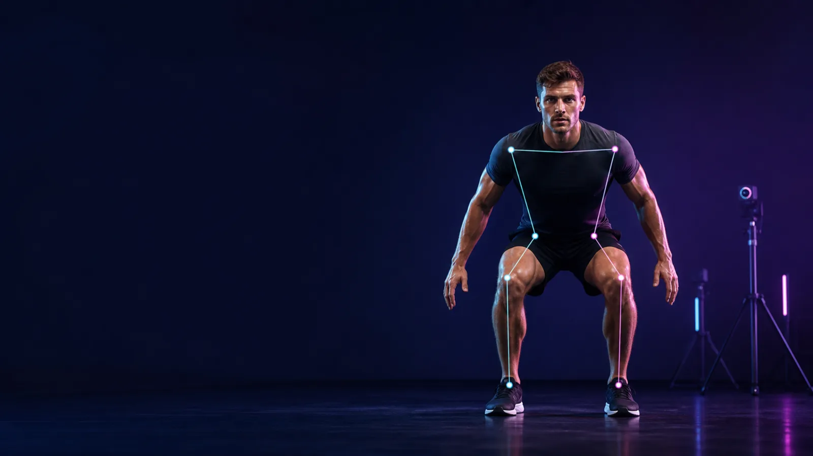
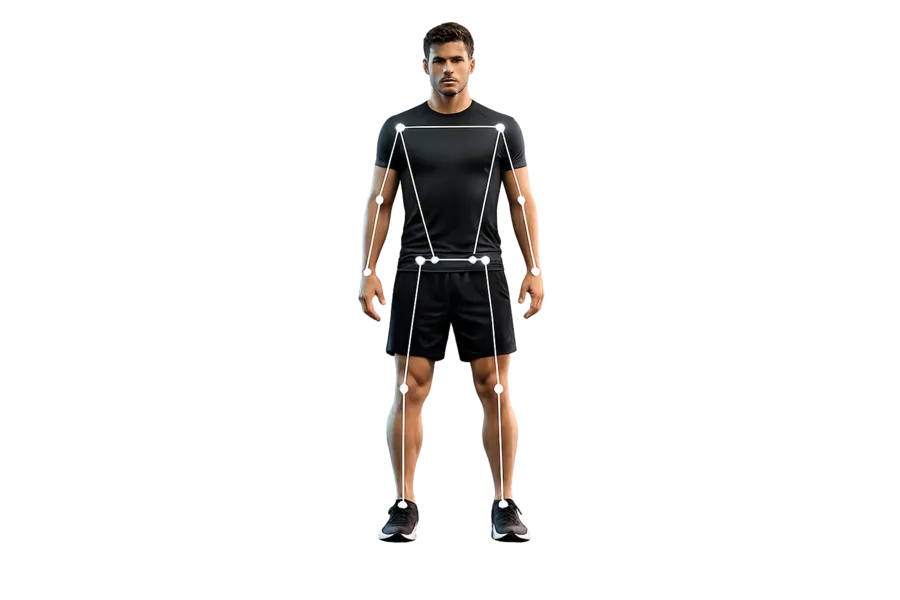
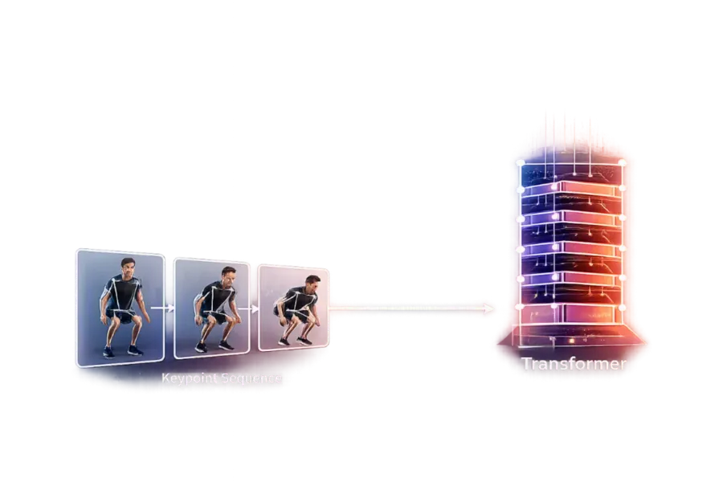
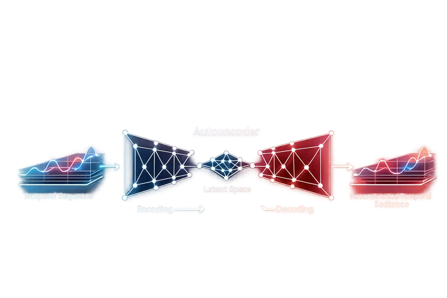
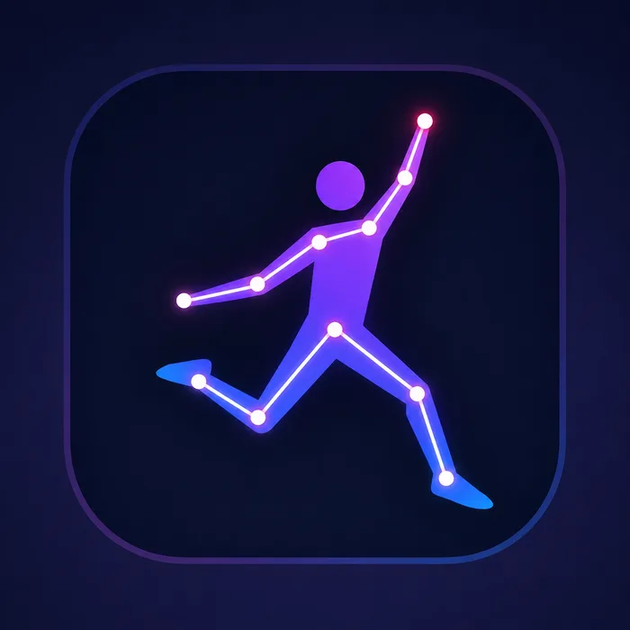
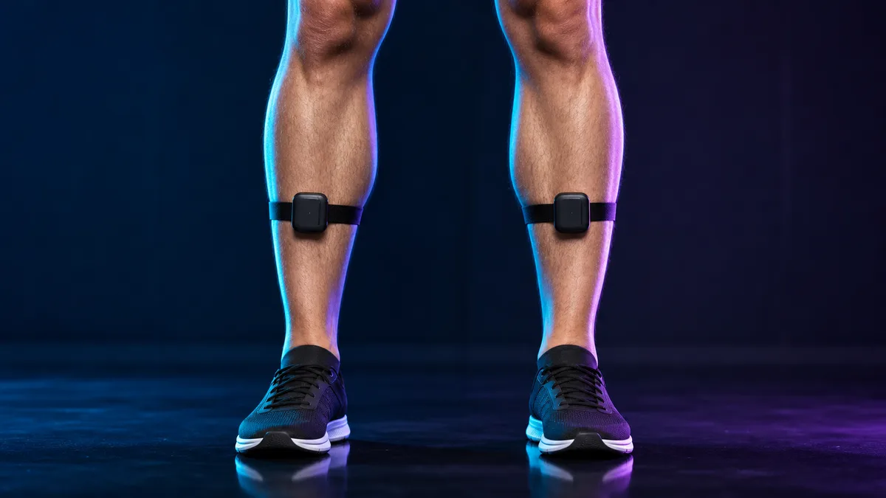

# JumpGuard

<p align="center">
  
</p>

<p align="center">
  <strong>From frontal video to synchronized, temporal movement analysis.</strong>
</p>

<p align="center">
  <a href="#current-workflow">Workflow</a> ·
  <a href="#active-model-inputs">Models</a> ·
  <a href="#running-the-gui">Run the app</a> ·
  <a href="#dataset-provenance">Dataset</a>
</p>

JumpGuard is a Python research prototype for temporal analysis of frontal-view
drop jumps. It combines guided webcam setup, YOLO pose estimation, automatic
drop detection, protocol validation, frame-by-frame shank-pitch estimation,
and LSTM-based movement anomaly detection.

The system does not reconstruct a full 3D pose and is not a clinical diagnostic
tool. It uses temporal patterns in frontal 2D landmarks to estimate changes in
sagittal shank pitch and to compare a valid drop-jump sequence with a learned
distribution of normal motion-capture movements.

## Current Workflow

1. The participant enters their height in centimetres.
2. One webcam stream remains open for setup and acquisition.
3. YOLO tracks one participant and requires both shoulders, hips, knees, and
   ankles to be visible.
4. The system captures a stable median pose on the floor.
5. The participant steps onto the box and holds a second stable pose.
6. Floor and box poses are used to estimate pixel scale, shoulder width, box
   height, and setup quality.
7. While the participant remains on the box, the system builds preparation
   baselines for the nose, ankles, body centre, and body height.
8. The preferred drop trigger is nose descent greater than
   `0.60 * box_height_px`. Bilateral ankle and body-centre descent provide a
   fallback when the nose or box-height cue is unavailable.
9. Seven valid frames preceding the trigger are retained, followed by valid
   pose frames recorded for the configured duration.
10. The video pipeline estimates initial contact and maximum knee flexion.
11. `DropJumpProtocolValidator` checks that the sequence contains a descent
    from height and sufficient post-landing lift to represent a rebound jump.
12. `PitchTransformer` estimates left and right shank-pitch change over time.
13. `JumpAutoencoder` evaluates 16 front-view biomechanical features over a
    runtime-selected movement window.
14. The Streamlit interface displays protocol status, movement status, anomaly
    details, pitch curves, and an interactive stick-figure replay.

The current analyzer exports initial-contact and maximum-flexion indices. It
does not export explicit takeoff or rebound-landing keyframe indices; the
rebound is validated from subsequent ankle or body-centre lift.

## Camera Setup and Capture

### Stable setup poses

The setup uses several consecutive poses rather than a single frame. A median
pose is accepted only when required landmarks remain sufficiently still. This
reduces YOLO jitter and prevents calibration while the participant is moving.

Participant height gives an approximate pixel scale:

```text
metres_per_pixel = participant_height_m / floor_body_height_px
```

The box height is estimated from the vertical difference between mean ankle
positions:

```text
box_height_px = floor_ankle_y - box_ankle_y
```

Because OpenCV y-coordinates increase downwards, ankles on the box have a
smaller y value. Approximate physical box height is stored as:

```text
estimated_box_height_cm = box_height_px * metres_per_pixel * 100
```

The setup validator checks camera roll, perspective proxies, camera-height
proportions, horizontal centring, frontal orientation, floor-to-box scale
stability, and whether box height was clearly detected. Scale instability and
failure to detect box height block acquisition; the other checks currently
produce warnings.

### Drop trigger

During box preparation, median baselines are maintained for the nose, left and
right ankles, mean ankle position, body centre, and body height.

The preferred trigger is:

```text
nose_drop_px > 0.60 * box_height_px
```

The nose is preferred because one foot can move before the whole body begins
to fall. The fallback requires all of the following:

```text
mean_ankle_drop > 0.06 * median_body_height_px
bilateral_ankle_drop > 0.45 * required_drop_px
body_center_drop > 0.25 * required_drop_px
```

An excessive upward ankle movement before the drop is rejected because it
indicates jumping upward from the box rather than dropping first.

## Active Model Inputs

<table>
  <tr>
    <td width="33%" align="center">
      <br>
      <strong>YOLO Pose</strong><br>
      Detects body landmarks.
    </td>
    <td width="33%" align="center">
      <br>
      <strong>PitchTransformer</strong><br>
      Estimates bilateral shank pitch.
    </td>
    <td width="33%" align="center">
      <br>
      <strong>JumpAutoencoder</strong><br>
      Detects unusual movement patterns.
    </td>
  </tr>
</table>

### YOLO Pose

YOLO returns the 17 COCO keypoints. Capture requires:

```text
left/right shoulder
left/right hip
left/right knee
left/right ankle
```

The confidence threshold for treating a keypoint as visible is `0.30`.
The nose is used for setup orientation and the preferred drop trigger, but head
keypoints are excluded from temporal model inputs.

### PitchTransformer

`PitchTransformer` receives:

```text
(B, T, 24)
```

The 24 channels are the x-coordinates followed by the y-coordinates of these 12
body keypoints:

```text
left shoulder, right shoulder,
left elbow, right elbow,
left wrist, right wrist,
left hip, right hip,
left knee, right knee,
left ankle, right ankle
```

Before inference, raw pixel keypoints are divided by the median shoulder-to-
ankle body-height proxy across the sequence.

The model output is:

```text
(B, T, 2)
```

representing left and right shank-pitch deltas in degrees. The Transformer uses
a causal attention mask, so each prediction can use only the current and
previous frames.

### JumpAutoencoder

The active autoencoder checkpoint is:

```text
models/jump_autoencoder_lstm.pt
```

It does not reconstruct the 24 raw keypoint channels. The active feature
extractor converts them into:

```text
(B, T, 16)
```

The 16 features, in exact code order, are:

1. `left_knee_flexion`
2. `right_knee_flexion`
3. `left_hip_flexion`
4. `right_hip_flexion`
5. `trunk_lateral_lean`
6. `knee_width_ratio`
7. `left_knee_valgus`
8. `right_knee_valgus`
9. `knee_center_vs_ankle_center`
10. `body_lean_over_ankles`
11. `left_leg_length_ratio`
12. `right_leg_length_ratio`
13. `knee_flexion_asymmetry`
14. `hip_flexion_asymmetry`
15. `leg_ratio_asymmetry`
16. `shoulder_tilt`

These angles and body-relative ratios reduce sensitivity to absolute frame
position, body size, camera distance, and left/right image convention. Elbow
and wrist coordinates are present in the 24-channel temporal representation
but are not used by the current 16-feature autoencoder extractor.

The LSTM encoder is bidirectional and compresses the sequence into a latent
vector. The decoder reconstructs the feature sequence. Anomaly information is
derived from normalized reconstruction error.

In the GUI, a trial can be flagged from its sequence score or from at least two
consecutive high-error frames. The saved threshold is multiplied by `10.0` at
runtime to reduce false positives on webcam input. This is an engineering
runtime policy, not a clinically validated threshold.

<p align="center">
  
</p>

## Runtime Analysis Window and Replay

The current CLI and Streamlit runtime begin the autoencoder window two valid
frames before the detected drop trigger:

```text
ae_start = max(0, trigger_index - 2)
```

After initial contact plus a one-second delay, the pipeline searches for a
1.5-second stillness interval. If one is found, the analysis ends one second
before the end of that interval; otherwise it uses the end of the recording.

This runtime window is not identical to the `0.5 seconds before initial contact
through takeoff` window described by older training documentation. Window
alignment should be standardised before a final independent evaluation.

The replay starts seven frames before the trigger when available. Initial
contact is marked in yellow and maximum knee flexion in green. Anomaly overlays
are shown only for frames covered by the autoencoder result.

## Running the GUI

Python 3.11 or newer is required. Create an isolated environment and install
the dependencies:

```bash
python3 -m venv .venv
source .venv/bin/activate
python -m pip install -r requirements.txt
```

Before starting the application, place the required runtime checkpoints in:

```text
models/yolo26n-pose.pt
models/pitch_transformer.pt
models/jump_autoencoder_lstm.pt
```

The YOLO checkpoint is required for capture. The PitchTransformer and
JumpAutoencoder checkpoints are produced by the training commands below and
are required for their corresponding analyses. These binary files are kept
local and are not included in Git.

Start the GUI from the repository root:

```bash
streamlit run scripts/streamlit_app.py
```

If camera access fails on macOS, grant camera permission to the application or
terminal running Streamlit, restart it, and try again.

## IMU Acquisition and Alignment

<p align="center">
  
</p>

The data-collection workflow supports two WITMOTION BWT901CL sensors, one per
shank, mounted approximately halfway between knee and ankle. This placement
tracks tibial-segment orientation more consistently than mounting directly over
the knee joint.

The readers store pitch, roll, and yaw. The current pitch model uses only left
and right pitch as supervision targets; roll and yaw remain available in the
saved data.

Live video frames and IMU samples are timestamped using the acquisition
computer's monotonic clock. The timestamp of the first retained video frame is
used as the common origin. Earlier IMU samples are discarded, and each sensor
series is linearly interpolated at the video timestamps.

This is software-clock alignment, not hardware synchronization. Bluetooth and
polling latency are not explicitly corrected because samples are timestamped
when received by the computer.

Find paired sensor ports with:

```bash
python scripts/list_sensor_ports.py
```

## Dataset Provenance

The external motion-capture source used by the training pipeline is the dataset
published by Zhao et al.:

> **Three-Dimensional Motion Capture Data of a Movement Screen from 183 Athletes**

The dataset contains 3D motion-capture recordings from 183 athletes performing
mobility and stability tests, including drop jumps. The original recordings
were collected at 120 Hz or 480 Hz with an eight-camera Raptor-E system and are
distributed in C3D and MATLAB formats. JumpGuard extracts one drop-jump sequence
per participant from the locally stored `Kinematic_Data` directory.

Reference: X. Zhao, G. Ross, B. Dowling, and R. B. Graham, *Scientific Data*
10, 2023. [https://doi.org/10.1038/s41597-023-02082-6](https://doi.org/10.1038/s41597-023-02082-6)

The name **Motus Global Biomechanics Database** does not refer to the dataset
used by this repository.


## Current Limitations

- The camera is monocular and frontal; sagittal motion is inferred from
  temporal correlations rather than uniquely reconstructed.
- Initial contact is estimated from landmark trajectories rather than measured
  with a force plate.
- The real IMU dataset currently contains a small number of trials from three
  participants, so reported pitch performance is not subject-independent.
- Synthetic variants derived from those real trials do not replace a genuine
  participant-level train/validation/test split.
- Anomaly output indicates distance from the learned normal distribution; it
  does not diagnose injury, pathology, or incorrect technique.


